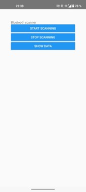

# Bicycle Trainer Mobile Application

This repository contains a mobile application built with React Native framework that serves as a bicycle trainer. The application communicates with a Bluetooth-enabled sensor module installed on the bicycle, which is manufactured by Onsemi. With this application, users can track their cycling sessions, monitor their performance.
This project was developed as part of a university assignment for the subject "Tímový projekt" in FEI STU.

###### Project Website: https://gabor-katona.github.io/

## Features

- Bluetooth Connectivity: The application establishes a Bluetooth connection with the Onsemi development board (BDK-GEVK) with sensor module (MULTI-SENSE-GEVB) to receive real-time data from the bicycle.
- Cycling Sessions: Users can start, pause, resume, and stop cycling sessions within the application.
- Data Analysis: The application stores cycling session data locally, allowing users to review and analyze their past performances.
- Map Integration: The application now includes a map feature that displays the path taken during cycling sessions. Users can view their route on a map within the app, providing a visual representation of their ride.

## Tech

This app uses a number of open source projects to work properly:

- React Native - 70.0
- buffer - 6.0.3 
- convert-string - 0.1.0 
- react-native-ble-manager - 8.4.4 
- react-native-chart-kit - 6.12.0 
- react-native-geolocation-service - 5.3.1 
- react-native-keep-awake - 4.0.0 
- react-native-leaflet-view - 0.1.2 
- react-native-select-dropdown - 3.3.3 
- react-native-sqlite-storage - 6.0.1 
- react-native-svg - 13.9.0 
- react-native-webview - 12.0.2 

## User Manual for the Application

To ensure the application functions correctly, it must have access to location services and nearby devices (Bluetooth).

### 1. Connecting to the Development Board

1. Enable Bluetooth and location services on your mobile phone.
2. Open the Bicycle Trainer application.
3. Click the "START SCANNING" button to search for BLE devices.

    

4. Available devices with their MAC addresses will be displayed. Click on the development board you want to connect to (the MAC address is located on the back of the device).

    

5. If the connection is successful, you will see a screen with buttons labeled "START MEASUREMENT," "DELETE DATA," "SHOW DATA," and a header indicating the connected device.

    

### 2. Measurement

1. After a successful connection, press the "START MEASUREMENT" button to start the measurement. An information message and the measurement number will be displayed. It's important to keep the screen on during the entire measurement.

    

2. You can pause the measurement by pressing the "PAUSE MEASUREMENT" button and continue it by pressing the "CONTINUE MEASUREMENT" button.

    

3. You can stop the measurement by pressing the "STOP MEASUREMENT" button. After stopping, a screen with the buttons "START MEASUREMENT," "DELETE DATA," and "SHOW DATA" will be displayed.

### 3. Data Display

1. Press the "SHOW DATA" button.

    

2. A screen with a "GO BACK" button will be displayed, allowing you to return to the previous screen, along with a dropdown menu containing measurement numbers. Select the number corresponding to the measurement you want to display.

    

3. A message saying “PLEASE WAIT” will be displayed while the data is being processed.
4. After processing, the measurement date, total distance, and graphs of temperature, humidity, pressure, altitude, speed (calculated from GPS coordinates and the accelerometer) will be displayed. Clicking on any point in the graph will show the value of that point. At the top, there are buttons for “SHOW MAP” and “ANIMATE INCLINATION.”

    

#### Show Map

- When you press the "SHOW MAP" button, a map with the marked route and starting position will be displayed. If an internet connection is not available, you will be prompted to connect before the map is displayed. Once connected, you can load the map by pressing the "REFRESH" button. Use the "GO BACK" button to return to the previous screen.

    

#### Animate Inclination

- When you press the "ANIMATE INCLINATION" button, a bicycle image will be displayed. Clicking on the bicycle will start an inclination animation during the ride. Holding the bicycle resets the animation, and clicking on it again restarts the animation.

    

### 4. Deleting Data

1. After connecting, you can delete the measured data by pressing the "DELETE DATA" button.

    

2. A screen with the message "Do you want to delete all measured data?" will be displayed. If you press the "YES" button, all measured data will be deleted, and you will return to the previous screen with the buttons "START MEASUREMENT," "DELETE DATA," and "SHOW DATA." If you press "NO," the data will not be deleted, and you will return to the previous screen.

    

## Documentation

[Documentation (slovak language)](doc/Dokumentácia.pdf)

## Technical Documentation

[Technical documentation (slovak language)](doc/Softverova_dokumentacia.pdf)

## Installation
Is described in the technical documentation.
